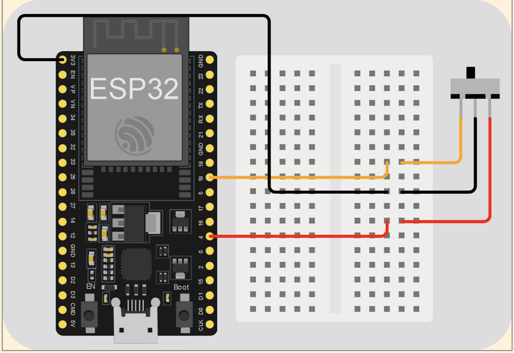
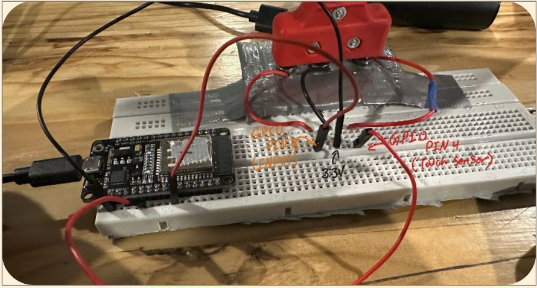

# Wireless Fencing Scoring System

## Table of Contents
- [Overview](#overview)  
- [Hardware](#hardware)  
- [Software and Dependencies](#software)  
- [Usage](#usage)  
- [Results and Demonstration](#results-and-demonstration)  

# Overview
This is a low-cost wireless fencing scoring system. Wired setups are not easily transportable, and cost upwards of $2000. While commercial wireless systems do exist, they are still priced in the hundreds of dollars, and are still not as reliable as wired ones. This project does not aim to mimic the reliability of traditional wired setups. Rather, it aims to provide epee fencers a portable and low-cost system that can be used at home, or to warm-up at tournaments when all wired strips are in use.

# Hardware:
-  [ESP32][esp32] - $15 x3 (need one per box)
-  Breadboard
-  LEDs
-  Dupont cables
-  [Epee socket](https://www.absolutefencinggear.com/af-clear-epee-socket.html) - $8 x2 (need one per box)
-  Small portable charger with short(3") usb->micro usb cable x2

## Client
<pre>

</pre>

1. Wire the 3v3 pin to the B-wire (middle) on the body cord
2. Wire GPIO pin 18 to the A-wire (closer side) on the body cord
3. Wire GPIO pin 4 to the C-wire (farther side) on the body cord
4. Repeat for the second fencer

## Server
<pre>

</pre>

1. GPIO pin 32 to the left LED (red)
2. GPIO pin 13 to the left guard LED (yellow)
3. GPIO pin 14 to the right LED (green)
4. GPIO pin 12 to the right guard LED (yellow)
5. (optional) GPIO pin 23 to a buzzer
6. Wire all negative leads of the LEDs (and buzzer) to a GND pin

# Software
- [Arduino IDE](https://www.arduino.cc/en/software/)
- Python
- Some way to run a localhost webserver (e.g., vscode live server extension)

# Usage:
1. Go to tools and set board to ESP32 dev module, set port to the port where you board is plugged in.
2. We first must find the MAC address of the ESP32 board, using the included Get_mac.ino program. The MAC address will be output to the serial monitor, you must manually convert it to the correct format seen in client.ino and server.ino (0xYY where YY is the corresponding 2 characters in the mac address). Do this for all 3 boards and take note of them.
3. Set `uint8_t peerMac[6]` in client.ino to the of the board you are using for server.ino and set `uint8_t peerMac1[6]` and `uint8_t peerMac2[6]` server.ino to the MAC addresses of each of the client boards
4. Download client.ino and server.ino to there respective boards. 
5. Use an epee body cord to connect to weapon and test. I use a small portable phone charger plugged into the arduino's mircro usb port for power while in use.

## GUI
1. Ensure you have python installed
2. Pick your favorite way to run a **localhost webserver** to serve `scoreboard.html`. I use a live server extension in VS Code
3. Create a virtual environment with `python -m venv .venv`
4. Run `pip install -r requirements.txt`
5. Start the live server
6. Make sure **BLUETOOTH IS TURNED ON** on your laptop or what ever device is running it
7. Run `python scoreserver.py`

# Demonstration
A demonstration of the system functioning can be viewed here: https://drive.google.com/file/d/1XURgGI5M1JVTMpQ95y5kLU4X0YSuW70X/view?usp=sharing

## Helpful links for further development
https://github.com/MatthewKazan/Bluetooth-Fencing-Scoring-System/
https://github.com/Yohannfra/Touche
https://github.com/OpenFencing/Wireless
https://patents.google.com/patent/WO2006052544A3/en
https://patents.google.com/patent/US9358443B2/en
https://patents.google.com/patent/US20080084281A1/en
https://static.fie.org/uploads/26/131720-book%20m%20ang.pdf
https://forum.arduino.cc/t/wireless-fencing-scoring-system-detecting-a-pwm-signal-without-common-ground/686963/48

Further development can be viewed here: https://github.com/whitej20/Bluetooth-Fencing-Scoring-System

[esp32]: https://www.amazon.com/ESP-WROOM-32-Development-Microcontroller-Integrated-Compatible/dp/B08D5ZD528?crid=1KQGSILLUSPXO&dib=eyJ2IjoiMSJ9.-OAftzGp2pa3bNKeqEG_7TZMLABy3y0V00ME9yq1mYbiRqIdQyjnsVatafK_RPPNLigZoBzOKFbpC5kCrswuaAl_-PC8_L4lnAW0-hRIaJpX6viJM2QxOZVYvb1vMHUncHTFGhRuwvxtwHDU4t-1J9Or1Q5muVG-blMYT2JGweIOJGwtyYJCZweP4cZOxsaMuvLuR_c5hTpUSzoyjhLYMDiV_rjagSXUSF47oOTN6pI.WDO2CBKejsCBxxisU2B3sZDryFxeOPsFxibK6ho9YlQ&dib_tag=se&keywords=esp32%2Badafruit&qid=1764278487&sprefix=esp32%2Badafruit%2Caps%2C104&sr=8-3&th=1